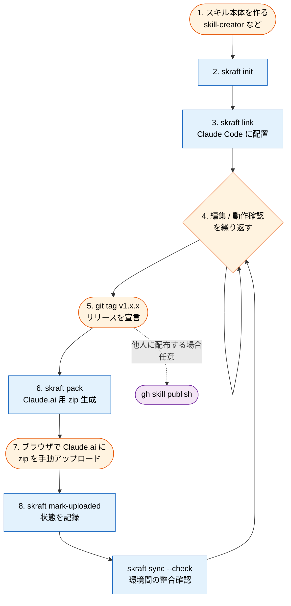

# skraft

> Your Claude skills, version-controlled.

`skraft` は、Claude のスキル (Agent Skills) を Git リポジトリで管理し、Claude Code と Claude.ai の間で一貫した状態に保つための、**スキル作者向けのローカル開発支援 CLI** です。

## なぜ skraft が必要か

Claude のスキルは便利な反面、運用で 3 つの問題に直面します:

1. **同じスキルを Claude Code と Claude.ai に二重管理することになる**
   片方を更新したら、もう片方にも手で反映しないとずれる。

2. **どちらにどのバージョンが入っているか分からなくなる**
   時間が経つと「最新版はどれだっけ」が誰にも分からない。

3. **`gh skill` は他人のスキルを配布する仕組みだが、自分のスキルをローカルで運用する仕組みは別途必要**
   個人の Git リポジトリを source of truth にして複数環境に展開する流れは、まだ手作業のまま。

`skraft` はこの隙間を埋めます。Git リポジトリを唯一の source of truth として、Claude Code には自動で、Claude.ai には半自動で、スキルの状態を同期します。

## 何ができるか

- **1 つの Git リポジトリで全スキルを管理する**
  スキルディレクトリの集まりを Git で管理し、リポジトリ全体に semver tag を切るシンプルな同期リリースモデルを採用します。

- **Claude Code に自動で配置する**
  `skraft link` で `~/.claude/skills/` への symlink を一括張る。以後、リポジトリ内のファイル編集はリアルタイムで反映されます。

- **Claude.ai 用の zip を生成する**
  `skraft pack` で `.git` などを除外した配布物を作成。Claude.ai は API 連携の手段がなくブラウザでの手動アップロードのみ対応のため、zip 生成と命名を自動化します。

- **環境間のずれを検知する**
  `skraft sync --check` で「Git の最新 tag」「Claude Code に配置済みのバージョン」「最後に Claude.ai にアップロードしたバージョン」を比較し、ずれているものを表示します。

- **責任分担を尊重する**
  スキル本体の作成は [Anthropic の skill-creator] が、配布は `gh skill` が、テストは Promptfoo が担当します。skraft は**それらの間にある状態管理だけ**を担います。

## ライフサイクル全体の中での位置付け

```
            [スキル作者]
                  ↓
              skraft        ← publisher 側のローカル開発支援
                  ↓
   ┌──────────────┼──────────────┐
   ↓              ↓              ↓
  Git          Claude Code     Claude.ai
(source of    (symlink で      (zip 手動
 truth)        ローカル配置)    アップロード)
                  
                  ↓ (公開する場合)
                  
              gh skill publish
                  ↓
              [他のスキル利用者]
                  ↓
       gh skill install で各エージェントホストへ
       (Claude Code, Codex, Cursor, Gemini CLI, Copilot, ...)
```

skraft 自身はスキルを作らず、テストもせず、配布もしません。各専門ツールに委譲し、**publisher 側でのスキル状態の管理と環境間の同期**だけに集中します。

## 全体の流れ

スキルの開発からリリースまでの一連の流れを示します。オレンジがユーザーの手作業、青が skraft コマンドです。



開発の中心は「**4. 編集 / 動作確認**」のループです。`skraft link` 済みなのでファイルを編集するだけで Claude Code に即反映され、確認しながら磨いていけます。リリースは `git tag` を切ることが宣言になり (ADR 0009)、そこから先 (zip 生成・アップロード状態の記録) を skraft が支援します。

## インストール

**Go 1.21+ がインストールされている場合:**

```bash
go install github.com/nyamage/skraft@latest
```

**ソースからビルドする場合:**

```bash
git clone https://github.com/nyamage/skraft.git
cd skraft
go build -o /usr/local/bin/skraft .
```

## クイックスタート

### 1. 既存のスキルリポジトリを skraft 管理下に置く

```bash
cd ~/dev/my-skills
skraft init
```

`.skraft/` ディレクトリと設定ファイルを作成します。**SKILL.md には一切変更を加えません。** 何度実行しても同じ結果になる、副作用のない操作です。

### 2. Claude Code に配置する

```bash
skraft link
```

リポジトリ内のすべてのスキルを `~/.claude/skills/` に symlink します。以後、リポジトリ内のファイルを編集すると Claude Code 側にも即座に反映されます。

### 3. 状態を確認する

```bash
skraft status
```

リポジトリの最新 tag、各スキルの Claude Code 配置状況、Claude.ai への最終アップロード状況を一覧表示します。

### 4. リリースする

```bash
git commit -am "fix: improve descriptions"
git tag v1.2.1
git push origin main --tags
```

skraft は git tag を正本としてバージョンを認識します。tag を切ることがリリースを意味します。

### 5. Claude.ai 用の配布物を作る

```bash
skraft pack
```

`dist/<skill>-<version>.zip` 形式で各スキルの zip を生成します (例: `dist/my-skill-v1.2.1.zip`)。ブラウザから Claude.ai の Settings → Capabilities → Skills にアップロードします。

Claude Code、Codex、Cursor、Gemini CLI、GitHub Copilot などへの配布は `gh skill install` を使ってください。skraft pack は **Claude.ai 専用**です。

### 6. アップロード後に状態を記録する

```bash
skraft mark-uploaded my-skill
```

Claude.ai は API を持たないため、アップロード完了を skraft に手動で伝えます。skraft が現在の git tag を自動取得して記録するので、バージョンを書き間違える心配はありません。

### 7. ずれがないか確認する

```bash
skraft sync --check
```

Git、Claude Code、Claude.ai の 3 環境間でバージョンがずれているスキルを表示します。Claude Code 側のずれは `--fix` で自動修復できます:

```bash
skraft sync --fix
```

Claude.ai 側のずれは構造上手動アップロードが必要なため、自動修復はせず、再アップロードすべきスキルとその zip パスを表示します。

## 提供するコマンド (v1)

| コマンド | 役割 |
| --- | --- |
| `skraft init` | リポジトリを skraft 管理下に置く |
| `skraft status` | 全スキルの状態を一覧表示 |
| `skraft pack [<skill>]` | Claude.ai 用の zip を生成 |
| `skraft link [<skill>]` | Claude Code に symlink を張る |
| `skraft unlink [<skill>]` | symlink を解除 |
| `skraft sync --check` | 環境間の drift を検知 |
| `skraft sync --fix` | Claude Code 側の drift を自動修復 |
| `skraft mark-uploaded <skill>` | Claude.ai へのアップロード状態を記録 |
| `skraft config get/set` | 設定の読み書き |
| `skraft new <name>` | リポジトリにスキルを新規作成し即リンク |
| `skraft adopt <name>` | `skills_dir` の既存スキルをリポジトリに取り込む |
| `skraft adopt --list` | まだ管理されていないスキルを一覧表示 |

## バージョニング

skraft はバージョン情報の正本として **git tag** を採用します。リポジトリ全体に 1 つの tag (例: `v1.2.0`) を切る同期リリースモデルです。これは [Agent Skills エコシステム][agent-skills] の標準的なパターンに従ったもので、`gh skill install owner/repo skill@v1.2.0` のような指定と整合します。

スキルごとに独立したバージョン管理が必要な場合は、リポジトリを分けることを推奨します。

## 何をしないか

skraft の責務を絞るため、以下は意図的に**やりません**:

- **スキル本体の作成** (Anthropic の skill-creator が担当)
- **スキルのテスト・評価** (Promptfoo などが担当)
- **スキルの公開・配布** (`gh skill publish` / `gh skill install` が担当)
- **Claude Code 以外のエージェントホスト (Codex、Cursor、Gemini CLI、Copilot 等) への配置** (`gh skill install` が担当)
- **観測・使用統計** (OpenTelemetry / Grafana などが担当)
- **SKILL.md の内容変更** (frontmatter を含めて一切編集しない、読むだけ)
- **スキル利用者向けの機能** (skraft は publisher 側のツールであり、他人が公開したスキルを取り込む用途は想定しない)

skraft は他のツールが扱わない**publisher 側のローカル開発と環境間同期のギャップだけ**を埋めます。

## 名前の由来

`skraft` は **skill + craft** の合成です。スキルを craft (丁寧に磨き上げる) するツール、という意味を込めています。ドイツ語の Kraft (力) とも音が通じます。

[agent-skills]: https://agentskills.io/specification
